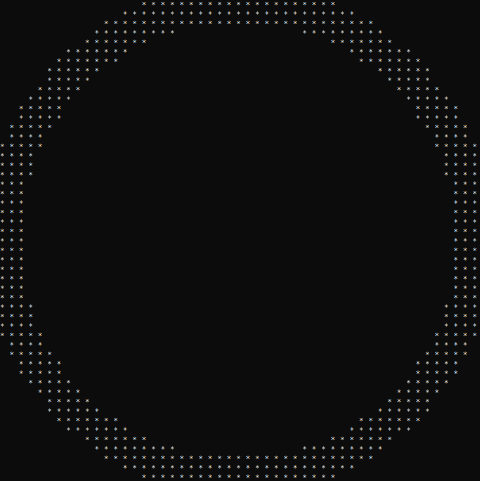

# python-circle
A Python program to generate circles of a specified diameter, thickness and weight (0-3).

Nothing advanced, just thought it was pretty cool :)

*A circle generated with diameter 50, thickness 2 and weight 2:*

